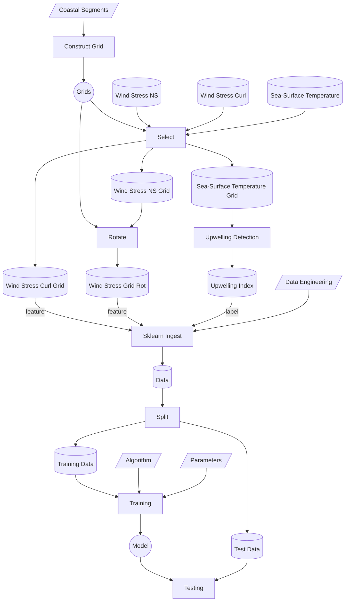

# Cabo-Verde-Upwelling

```mermaid
flowchart TD
    WS[(Wind Stress NS)]
    WC[(Wind Stress Curl)]
    WCG[(Wind Stress Curl Grid)]
    WSG[(Wind Stress NS Grid)]
    WSGR[(Wind Stress Grid Rot)]
    SST[(Sea-Surface Temperature)]
    SSTG[(Sea-Surface Temperature Grid)]

    FR[Construct Grid]

    AB[/Coastal Segments/]
    G((Grids))

    AB --> FR

    FR --> G

    SEL[Select]

    G --> SEL
    WS --> SEL
    WC --> SEL
    SST --> SEL

    SEL --> SSTG
    SEL --> WSG
    SEL --> WCG

    ROT[Rotate]

    G --> ROT
    WSG --> ROT

    ROT --> WSGR

    UPWI[Upwelling Detection]

    UI[(Upwelling Index)]

    SSTG --> UPWI
    UPWI --> UI

    SKLRN[Sklearn Ingest]

    SPLT[Split]

    WCG -- feature --> SKLRN
    WSGR -- feature --> SKLRN
    UI -- label --> SKLRN
    DENG[/Data Engineering/] --> SKLRN

    SKLRN --> DATA[(Data)]

    DATA --> SPLT

    SPLT --> DATATRN[(Training Data)]
    SPLT --> DATATST[(Test Data)]

    TRN[Training]
    TST[Testing]

    DATATRN --> TRN

    MOD((Model))

    ALG[/Algorithm/]
    PARAM[/Parameters/]

    ALG --> TRN
    PARAM --> TRN

    TRN --> MOD

    MOD --> TST
    DATATST --> TST
```